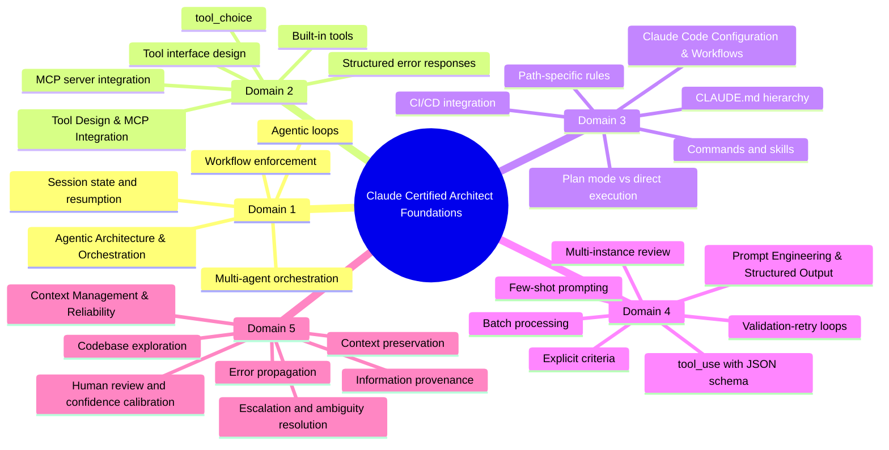

# Claude Certified Architect Foundations Study Notes

这是一个基于 `Claude Certified Architect (Foundations)` 学习过程沉淀出来的学习仓库。

这个仓库聚焦 `Claude Certified Architect Foundations`、`Claude Code`、`MCP（模型上下文协议）`、`Prompt Engineering（提示工程）`、`Structured Output（结构化输出）`、`Context Management（上下文管理）` 等核心考试主题，适合用来做系统化复习、考前冲刺与 domain（领域） 导航。

灵感来源于这条 X（Twitter）推文中的 domain（领域）提示词：

- https://x.com/hooeem/status/2033198345045336559?s=20

这个仓库不是对推文内容的逐字转录，而是基于那条推文提供的 domain 提示词骨架，结合实际教学过程，逐个 domain 展开出的完整学习资料。

## 快速导航

- [思维导图](#思维导图)
- [学习方法](#学习方法)
- [Domain 总览](#domain-总览)
- [仓库结构](#仓库结构)
- [推荐使用方式](#推荐使用方式)
- [FAQ](#faq)

## 思维导图

## Domain 总览

| Domain | 主题 | 关键词 |
|---|---|---|
| Domain 1 | `Agentic Architecture & Orchestration（代理式架构与编排）` | agentic loops, multi-agent orchestration, workflow enforcement |
| Domain 2 | `Tool Design & MCP Integration（工具设计与 MCP 集成）` | tool descriptions, MCP servers, tool_choice, structured errors |
| Domain 3 | `Claude Code Configuration & Workflows（Claude Code 配置与工作流）` | CLAUDE.md hierarchy, skills, commands, CI/CD |
| Domain 4 | `Prompt Engineering & Structured Output（提示工程与结构化输出）` | explicit criteria, few-shot, tool_use, schema, batch processing |
| Domain 5 | `Context Management & Reliability（上下文管理与可靠性）` | case facts, escalation, error propagation, provenance |

## 学习方法

整个学习过程采用固定方法：

1. 我负责提供每个 domain（领域）的提示词与考试目标
2. Claude 按 certification（认证）考试结构逐节教学
3. 每个 domain 都包含：
   - `知识点笔记`
   - `学习路线图`
   - `综合练习`
4. 每个 domain 学完后，都会完成对应模拟测验并记录结果

术语统一采用 `English（中文）` 的形式，正文以中文为主。

## 仓库结构

### `Claude_Certified_Architect_Domain1`
- `Domain1_知识点笔记.md`
- `Domain1_学习路线图.md`
- `Domain1_综合练习_可再生能源研究系统.md`

主题：
- `Agentic Architecture & Orchestration（代理式架构与编排）`

### `Claude_Certified_Architect_Domain2`
- `Domain2_知识点笔记.md`
- `Domain2_学习路线图.md`
- `Domain2_综合练习_MCP工具设计与集成.md`

主题：
- `Tool Design & MCP Integration（工具设计与 MCP 集成）`

### `Claude_Certified_Architect_Domain3`
- `Domain3_知识点笔记.md`
- `Domain3_学习路线图.md`
- `Domain3_综合练习_ClaudeCode配置与工作流.md`

主题：
- `Claude Code Configuration & Workflows（Claude Code 配置与工作流）`

### `Claude_Certified_Architect_Domain4`
- `Domain4_知识点笔记.md`
- `Domain4_学习路线图.md`
- `Domain4_综合练习_结构化抽取与验证重试.md`

主题：
- `Prompt Engineering & Structured Output（提示工程与结构化输出）`

### `Claude_Certified_Architect_Domain5`
- `Domain5_知识点笔记.md`
- `Domain5_学习路线图.md`
- `Domain5_综合练习_上下文保真与可靠性.md`

主题：
- `Context Management & Reliability（上下文管理与可靠性）`

## 推荐使用方式

每个 domain（领域）建议按下面顺序使用：

1. 先看 `学习路线图`
2. 再看 `知识点笔记`
3. 最后做 `综合练习`

如果你是为了考试冲刺：

1. 先通读 5 个 domain 的 `知识点笔记`
2. 再看每个 domain 的 `模拟测验结果`
3. 最后做综合练习，强化场景迁移能力

## 当前完成状态

目前已完成：

- Domain 1
- Domain 2
- Domain 3
- Domain 4
- Domain 5

并且每个 domain 都已经完成了对应的模拟测验与结果记录。

## 这个仓库解决什么问题

- 如果你想系统学习 `Claude Certified Architect Foundations`，这里按 domain（领域） 拆好了完整材料
- 如果你已经会用 `Claude Code`，但对 `MCP`、`Prompt Engineering`、`Context Management` 的考试边界不稳，这里有针对性的错题型讲解
- 如果你想把一条推文里的考试提示词扩展成可复习、可回顾、可实战演练的资料，这个仓库就是成品

## 适合谁

这个仓库适合：

- 正在准备 `Claude Certified Architect (Foundations)` 的学习者
- 想快速建立 5 个核心 domain（领域）知识框架的人
- 想把考试知识点转成可复习文档与练习材料的人

## 说明

- 这是学习资料仓库，不是官方教材
- 内容基于真实对话式学习过程整理
- 重点偏考试判断标准、架构边界与高频陷阱

## FAQ

### 1. 这个仓库适合谁？

适合准备 `Claude Certified Architect (Foundations)` 的学习者，尤其适合想系统梳理 `Domain 1-5`、同时关注 `Claude Code（Claude Code）`、`MCP（模型上下文协议）`、`Prompt Engineering（提示工程）` 与 `Context Management（上下文管理）` 的人。

### 2. 这个仓库覆盖哪些认证主题？

目前覆盖：

- `Domain 1: Agentic Architecture & Orchestration`
- `Domain 2: Tool Design & MCP Integration`
- `Domain 3: Claude Code Configuration & Workflows`
- `Domain 4: Prompt Engineering & Structured Output`
- `Domain 5: Context Management & Reliability`

### 3. 如何用这个仓库备考？

建议先按 `学习路线图` 建立全局框架，再读 `知识点笔记`，最后做 `综合练习`。如果你时间很紧，可以优先看各 domain 的错题、高频陷阱和标准表述。

### 4. 这个仓库和那条 X（Twitter）推文是什么关系？

推文提供了 domain（领域） 提示词和学习触发点；这个仓库是在此基础上，把每个 domain 扩展成完整教学、测验、纠错与练习材料。
